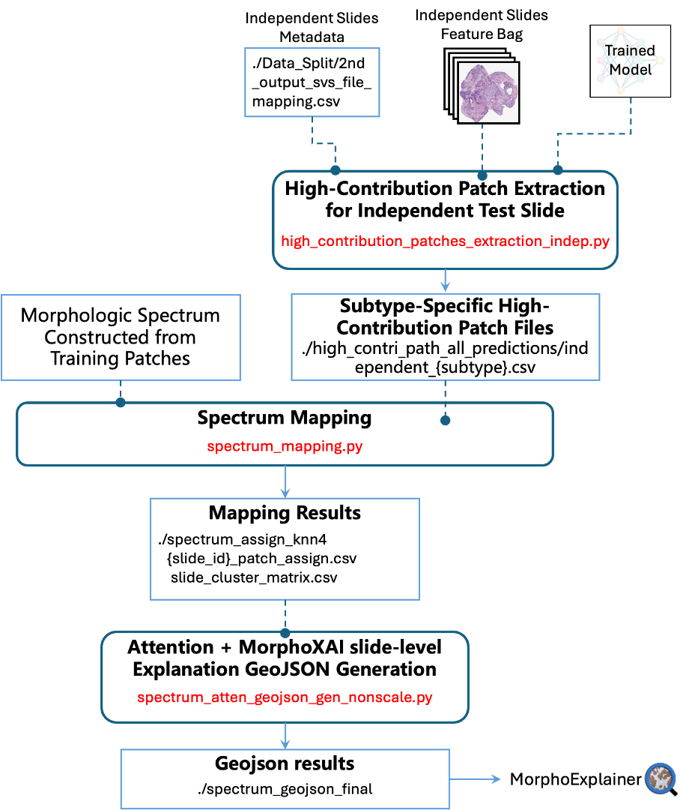

# MorphoXAI – Stage 2: Slide-level Explanations for Independent Test Slides

## Pipeline Overview

In the Stage 1, we constructed a global explanation — the Morphologic Spectrum — using high-contribution patch embeddings and their clustering results derived from the training set. This spectrum characterizes the core and transitional histomorphological patterns learned by the model during training, providing a global view of the model’s decision structure.

Building on this spectrum, the present module generates slide-level explanations (local explanations) for predictions made by the full-data model on independent test slides. These local explanations indicate which regions of the slide the model relies on most heavily and specify which morphologic-spectrum patterns these regions correspond to. The resulting local explanations are exported in GeoJSON format, which can be imported into MorphoExplainer for interactive visualization directly on the whole-slide image.

The figure below provides a macroscopic view of the workflow within this module. It summarizes how different scripts are connected, the inputs they consume, and the outputs they produce.

<p align="center">
  
</p>

## **Step 1 –** High-Contribution Patch Extraction for Independent Test Slide

### 1. Purpose of This Script

This script extracts high-contribution patches from independent test slides for *each* prediction class of the full-data model.
 Given the full-data model checkpoint and the CONCH feature bags of the independent slides, the script:

- performs per-class forward inference on each slide,
- computes patch-level attention scores and attention weights,
- selects the top-k high-contribution patches by cumulative contribution (default: top 90%), and
- writes all extracted patches (across all prediction classes) into a unified CSV file.

### 2. Required Inputs

This step requires three inputs, all consistent with Stage 1 formats:

1. **Independent Test Metadata CSV**
   - Same structure as Stage 1 metadata
   - Must include: `Person ID`, `Tissue ID`, `Subtype`, `SVS Filename`, `source_folder`
2. **Full-Data Model Checkpoint**
   - The MIL model trained on the full dataset (the model to be explained)
3. **Feature Bags for the Independent Slides**
   - Same `.h5` format as Stage 1 feature bags
   - Must contain: `features`, `coords`, `tile_ids`

### 3. Example Usage

A full example is provided in: `./notebooks/interpretation_of_individual_slide.ipynb`.

### Output of This Script

Running this script produces **two types of outputs**:

#### **1. Unified CSV: `high_attened_patches_indep_data.csv`**

This file aggregates **all high-contribution patches** extracted from **all independent test slides** and **all prediction classes**.

Each row corresponds to one high-contribution patch and contains the following fields:

| Column       | Description                                                  |
| ------------ | ------------------------------------------------------------ |
| **slide_id** | Slide identifier (WSI ID, without extension)                 |
| **label**    | Ground-truth subtype (short name)                            |
| **pred**     | Prediction class for which this patch is considered high-contribution |
| **tile_id**  | Unique patch ID within the feature bag                       |
| **weight**   | Attention weight                                             |
| **score**    | Logits-based contribution score for the prediction class     |
| **embed**    | Patch-level CONCH embedding                                  |

------

#### **2. Per-Label Subset CSVs (automatically generated)**

For convenience in downstream processing, the unified CSV is automatically split by ground-truth label into multiple subtype-specific CSVs. The example filenames shown below correspond to our ovarian tumor dataset including 4 subtypes:

```
independent_Clear.csv
independent_Endo.csv
independent_High.csv
independent_Border.csv
```

## **Step 2 – Spectrum Mapping for Independent Slides**

### **1. Purpose of the Script**

`spectrum_mapping.py` maps **independent-test high-contribution patches** onto the **Morphologic Spectrum** constructed in the interpretability analysis module.

This script loads `morphologic_spectrum_stats.pkl` produced during Stage 1 and performs pattern assignment for each slide:

1. performs Mahalanobis-based soft assignment of each high-contribution patch,
2. applies a hybrid assignment rule for transitional patterns when applicable
   (e.g., EC–HGSC transitions in the ovarian tumor dataset), and
3. writes a patch-level spectrum-mapping CSV for each slide.

This output is used by the next step to generate slide-level MorphoXAI explanations.

------

### 2. Required Inputs

#### **1. Morphologic Spectrum Statistics**

This file（`morphologic_spectrum_stats.pkl`）contains the precomputed spectrum statistics generated in **Stage 1, Step 8** (`export_spectrum_stats.py`).

#### **2. Independent high-contribution patch files**

These files are generated by Stage 2 Step 1.

#### **3. Slide-level summary of full-data model predictions**

Spectrum mapping requires a slide-level summary of the full-data model’s predictions on the independent test set (each_slide_result). This CSV contains one row per slide and must include the following columns:

- `slide_id`
- `name_label` — ground truth subtype
- `name_pred` — predicted subtype
- `correctness` — True/False

This file is used solely to determine the slide’s true subtype, so that spectrum-mapping results can be grouped and saved accordingly.

------

### 3. Example Usage

A full example is provided in: `./notebooks/interpretation_of_individual_slide.ipynb`.

### **Outputs**

#### **1. Slide-level Spectrum-Mapping CSV**

For each independent test slide, the script produces a file named:`{slide_id}_patch_assign.csv`.

This file contains one row per high-contribution patch and records its assignment to the morphologic spectrum. The key columns are:

- **`slide_id`**, **`tile_id`** – identifiers for the slide and patch
- **`pred`** – the model-predicted subtype for this slide
- **`assigned_cluster`** – the final spectrum pattern assigned to this patch

#### **2. Slide×cluster proportion matrix**

A summary table named `slide_cluster_matrix.csv`.

This file reports, for each slide, the proportion of patches assigned to each morphologic-spectrum cluster. It is useful for visualizing how a slide’s patch distribution relates to the global morphologic spectrum. Main columns include:

- **`slide_id`** – slide identifier
- **`group`** – true subtype of the slide
- **`cluster proportion column`** – one column per spectrum cluster
- **`Outlier`** – proportion of patches falling outside all spectrum clusters

## Step 3 – Attention + Spectrum GeoJSON Generation (Single Slide)

### **Purpose of the Script**

This script generates a **slide-level explanation** for a single independent WSI by **combining attention heatmaps and morphologic-spectrum annotations**.

Given the spectrum-mapping results produced by Step 2, the corresponding CONCH feature bag, and the full-data model checkpoint, this script:

1. Reads the mapped spectrum clusters (`{slide_id}_patch_assign.csv`, output of `spectrum_mapping.py`)
2. Matches patch IDs with the original H5 feature bag to recover patch coordinates
3. Runs the AttentionNet model to compute per-class attention scores
4. Fuses attention tiles + spectrum annotations into ONE GeoJSON file, ready to be imported into MorphoExplainer
5. (Optional) Generates per-class JPG overlays for QA visualization

The resulting GeoJSON provides a **morphology-grounded, interpretable, slide-level explanation** for how the model makes predictions which could be visualized via MorphoExplainer.

------

### Required Inputs

#### **1. path to the input WSI**

Absolute path to the `.svs` file of the slide to be explained.

------

#### **2. directory containing Step 2 mapping results**

This directory stores the `{slide_id}_patch_assign.csv` files produced
 by **spectrum_mapping.py**. Used to retrieve the per-patch spectrum assignments for this slide.

------

#### **3. directory containing feature bags**

Path to the `.h5` feature-bag directory which contains the feature bag of the input slide. 

------

#### **4. full-data model checkpoint**

Checkpoint of the trained MIL model used to compute attention scores. The attention map is combined with spectrum assignments to produce the final GeoJSON overlay.

------

#### **5. slide-level metadata for independent test slides**

CSV containing the paths and metadata of independent slides. Used to resolve slide IDs and file naming.

### **Outputs**

This script produces two major outputs for a single slide.

------

#### **1. Tiles CSV (Spectrum + Coordinates)**

For each independent test slide, the script produces a file named:`{slide_id}_spectrum_tiles.csv`, which contains (per patch):

- `slide_id`
- `tile_id`
- `cluster` (spectrum cluster assigned by spectrum_mapping.py)
- `pred` (subtype for which this patch is relevant)
- `x, y, width, height` (patch coordinates derived from H5)

------

#### **2. Final GeoJSON (Attention + Spectrum)**

This GeoJSON can be directly loaded into MorphoExplainer, where it visualizes both the spectrum-based slide-level explanations and theattention heatmaps for the model’s predictions.

------

#### **3. Per-class Attention JPG Overlays**

If `--save-jpg` is enabled, the script also produces **attention heatmap JPGs** for the slide.

## MorphoExplainer: QuPath Extension for Visualizing MorphoXAI slide-level explanation

For details on how to visualize the GeoJSON explanation files in MorphoExplainer—as well as the full GeoJSON schema specification—please refer to the **MorphoExplainer Manual** in the `plugins/` directory.