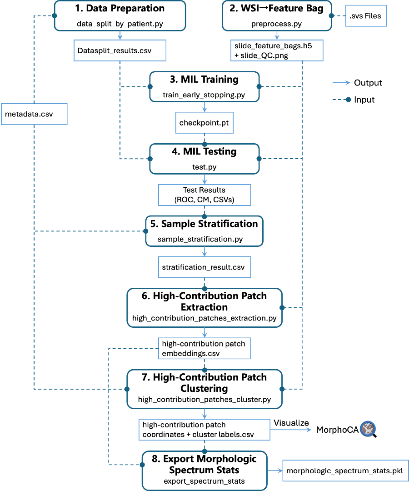

# MorphoXAI – Stage 1: Morphologic Spectrum Construction

## Pipeline Overview

The diagram below provides a high-level overview of the Stage 1 workflow.
It illustrates how individual scripts in this repository interact, the inputs
they consume, and the outputs they produce. Together, these components form
the complete pipeline for morphologic spectrum construction. A runnable demo of Stage 1 workflow is provided in the `notebooks/morphologic_spectrum_construction.ipynb`.

<p align="center">
  
</p>


## Step 1 – Data Preparation

### 1. Purpose of the script

The script `data_split_by_patient.py` creates the patient-level train/test splits used in MorphoXAI’s prediction-stability–based sample stratification procedure.

- For a given cohort, the patient list is randomly shuffled `split_num` times to generate multiple independent datasets.
- Within each dataset, all slides are grouped by patient and then partitioned into `fold_num` folds.
- In each fold, slides are allocated to **training, validation, and test sets** according to the ratios specified by `train_ratio`, `val_ratio`, and `test_ratio`.
- Crucially, the split is performed at the patient level, ensuring that no patient’s slides appear across more than one set.
- The outcome is `split_num × fold_num` distinct train/val/test splits, ready to be used directly for model training and evaluation.

Two splitting strategies are supported:

- **even**: attempts to balance the number of slides across folds
- **random**: assigns patients randomly to folds

---

### 2. Input Metadata CSV format

Before running the data split script, the cohort metadata must first be prepared in a CSV file. This file defines the slide-level information for all samples and serves as the input for generating cross-validation splits.

The CSV must contain the following columns:

- **Person ID** – unique patient identifier
- **Tissue ID** – unique tissue or block identifier
- **Subtype** – diagnostic label for the slide
- **SVS Filename** – filename of the WSI (without or with `.svs` extension)
- **source_folder** – directory where the raw WSI file is located

An example can be found in `./Data_Split/output_svs_file_mapping.csv`.

------

### 3. Example run

```
python -u data_split_by_patient.py \
    --mode random \
    --split_num 5 \
    --fold_num 10 \
    --train_ratio 0.6 \
    --val_ratio 0.2 \
    --test_ratio 0.2 \
    --data_csv ./Data_Split/output_svs_file_mapping.csv \
    --output_dir ./Data_Split \
    --label_config ./config.yaml
```

This will create 5 shuffled splits, each with 10 folds, and save the CSV outputs in `./Data_Split`. Refer to the code in `data_split_by_patient.py` for a full explanation of all command line arguments.

------

### 4. Outputs (Data Preparation)

Each shuffle produces a single CSV file, named in the format `Datasplit_{s_index}_{n_folds}_fold_by_patient.csv`, where `s_index` indicates the split index and `n_folds` specifies the number of folds.

In this file, each row corresponds to a slide, with the following key columns:

- **Person ID**: patient identifier
- **slide_id**: derived from SVS filename (basename without `.svs`)
- **class**: Subtype name as provided in the input CSV
- **label**: numeric label (from `config.yaml` mapping)
- **round-0 … round-9**: assignment of this slide in each CV round (`training`, `validation`, `testing`, or `unknown`)

This format allows downstream training scripts to easily load the correct slides for each shuffle and fold.

## Step 2 – Converting each WSI into a bag of feature vectors

### 1. Purpose of the script

Before model training, each WSI in the cohort should be converted into a bag of feature vectors using a feature extractor. The script `preprocess.py` uses CONCH to embed each tissue patch and saves the result to an `.h5` file. A corresponding QC image is also generated with the suffix `_features_QC.png`.

**Note on encoder origin:** this preprocessing code contains a fork of [AIRMEC/im4MEC](https://github.com/AIRMEC/im4MEC/tree/main). The original used a **MoCo** encoder; here we use **CONCH**.

### 2. Input

**`--WSIFILE`**: The path of the WSI (.svs file) to be processed. 

### 3. Example Run

```
python -u preprocess.py \
  --input_slide WSIFILE \
  --output_dir feature_bags \
  --tile_size 360 \
  --out_size 224 \
  --batch_size 256 \
  --workers 8
```

Refer to the code in `preprocess.py` for a full explanation of all command line arguments.

**Hugging Face token:** when loading CONCH, use your own token in `hf_auth_token`:

```python
model, preprocess = create_model_from_pretrained(
    'conch_ViT-B-16',
    'hf_hub:MahmoodLab/conch',
    hf_auth_token=''  # <- put your Hugging Face token here
)
```

### 4. Outputs (Converting WSI)

For each processed WSI, two types of files are produced in the specified `--output_dir`:

1. **Feature file (`.h5`)**
   - Filename: `{Slide_ID}.h5`
   - Contents:
     - A dataset of feature vectors, one per extracted patch.
     - Each vector corresponds to the embedding produced by the CONCH encoder.
     - Patch metadata (e.g., tile coordinates and dimensions) are also stored to allow mapping back to the WSI.
2. **Quality Control image (`_features_QC.png`)**
   - Filename: `{Slide_ID}_features_QC.png`
   - A downsampled thumbnail of the WSI with patch locations overlaid.
   - Provides a quick visual check to ensure that tiling and patch embedding were performed correctly.

These outputs together form a **bag-of-features representation** for each WSI, which can be directly used as input to downstream MIL models such as CLAM.

## Step 3 – MIL Training

### 1. Purpose of the script

MorphoXAI adopts the CLAM framework as the MIL model for Stage 1. To train CLAM for WSI-level prediction, use `train_early_stopping.py`. This script implements a k-fold cross-validation routine and applies early stopping. The best model checkpoint for every fold is saved in ` ./runs`.

### 2. Input

- **`--manifest`**:  A CSV file produced during  [Data Preparation](#4-outputs-data-preparation) for each data shuffle named as `Datasplit_{s_index}_{n_folds}_fold_by_patient.csv`.
- **`--feature_bag_dir`**: Directory where all *_features.h5 files are stored generated from [Converting each WSI into a bag of feature vectors](#4-outputs-converting-wsi) .

### 3. Example Run

```
# Pick the split index (from Data Preparation) and number of folds used there
s_index=0
n_folds=10

# The manifest is the CSV produced by Data Preparation
label_file="Datasplit_${s_index}_${n_folds}_fold_by_patient.csv"

for round in $(seq 0 $((n_folds-1))); do
  python -u train_early_stopping.py \
    --manifest "${label_file}" \
    --feature_bag_dir feature_bags \
    --config ./config.yaml \
    --round "${round}" >> ./Train_Output.txt 2>&1
done
```

> **Note**: All training hyperparameters are read from `config.yml`. We provide a reference configuration file with reasonable defaults, but users are encouraged to adjust these values to fit their own dataset and experiments.

### 4. Outputs (Model Training)

Running `train_early_stopping.py` produces the following outputs:

**Model checkpoints**

- Checkpoints are saved under `./runs/` in subfolders named according to the data split and the round index, e.g.:

  ```
  runs/Datasplit_0_10_fold_by_patient_random/round_0_small_random_hp1/
  ```

  This example corresponds to the **best model** obtained from the first shuffle (`Datasplit_0_10_fold_by_patient_random`) during round 0 of cross-validation.

- Each subfolder contains the **best model checkpoint** (selected based on validation performance) in PyTorch format:

  ```
  {round}_{epoch}_checkpoint.pt
  ```

### Script: `run_all_splits.sh`

We provide a helper shell script `run_all_splits.sh` in this repository, which launches training for all splits and folds across multiple GPUs, automatically managing GPU assignment and logging. Use this script when you want to launch all splits/folds in parallel across the available GPUs, without manually scheduling each job.

**Notes:** This training code contains a fork of [AIRMEC/im4MEC](https://github.com/AIRMEC/im4MEC/tree/main). We extended it by adding **early stopping** support. The script also retains the argument `--full_training`, which allows retraining the model on the entire **training + validation set** by specifying a hyperparameter index. 

## Step 4 – MIL Testing

The script `test.py` evaluates trained MIL models on the held-out test sets produced during cross-validation.

### 1. Evaluation metrics

For each hyperparameter set and each CV round, the following metrics are computed **per class**:

- **AUC** (Area Under the ROC Curve)
- **Sensitivity** (Recall)
- **Specificity**
- **Precision–Recall AUC (PR-AUC)**
- **F1-score**
- **Random baseline F1** (based on class distribution)

In addition to numerical metrics, the script generates visualizations:

- **ROC curves with 95% confidence intervals** (per class)
- **Macro-averaged ROC curves** (across classes)
- **Confusion matrix heatmaps** (aggregated over all test predictions)

### 2. Inputs

- **`--manifest`**:  A CSV file produced during  [Data Preparation](#4-outputs-data-preparation) for each data shuffle named as `Datasplit_{s_index}_{n_folds}_fold_by_patient.csv`.
- **`--feature_bag_dir`**: Directory where all *_features.h5 files are stored generated from [Converting each WSI into a bag of feature vectors](#4-outputs-converting-wsi) .
- **`checkpoint_dir`**: Directory where all checkpoints are stored generated from [Model Training](#4-outputs-model-training) .

### 3. Example run

```
#!/bin/bash
output_dir="./Test_Output"
mkdir -p "${output_dir}"

label_file="Datasplit_0_10_fold_by_patient_random.csv"

check_dir="./runs"

test_log="${output_dir}/test_output.txt" 
python -u test.py \
    --manifest ${label_file} \
    --feature_bag_dir feature_bags \
    --checkpoint_dir ${check_dir} \
    --config ./config.yaml \
    --round_num 10 >> "${test_log}" 2>&1 &
wait
```

### 4. Output results

All outputs are organized under `./test_result/{dataset_name}/` for each dataset, where `{dataset_name}` corresponds to the CSV manifest used (e.g. `Datasplit_0_10_fold_by_patient_random`).

- **Per-slide results** (`each_slide_result/`):
  - `{hp}_each_slide_result.csv`
  - Contains predictions and probabilities for every slide in each round.
- **Per-round summary**:
  - `each_round_result.csv`
  - One row per class per round, including AUC, Sensitivity, Specificity, PR-AUC, and F1.
- **Final aggregated summary**:
  - `final_result.csv`
  - Mean ± std for each metric across all rounds, per class and per hyperparameter set.
  - Also includes macro-averaged AUC values.
- **ROC curve figures** (under `./ROC_Curve/{dataset_name}/`):
  - `{hp}_roc_curve_{class}.png`: ROC curve with 95% CI for each class.
  - `{hp}_macro_averaged_roc_curve.png`: Macro-averaged ROC curve.
- **Confusion matrix figure** (under `./test_result/{dataset_name}/`):
  - `confusion_matrix.png`: heatmap of the aggregated confusion matrix.

## Step 5 – Sample Stratification

### 1. Purpose of the script

The `sample_stratification.py` script aggregates **per-slide prediction results** across all shuffles and cross-validation folds, and then assigns each slide to one of three stability categories.

Since `split_num × fold_num` distinct train/val/test splits are generated, each slide is evaluated multiple times. Based on its predictive accuracy (**Acc**) over all test runs, a slide is categorized as:

- **Consistently_Correct** – prediction accuracy ≥ 90%
- **Consistently_Incorrect** – prediction accuracy ≤ 10%
- **Highly_Variable** – prediction accuracy between 10% and 90%

It works by collecting `*_each_slide_result.csv` files generated during MIL model testing, computing per-slide accuracy, tracking misclassification frequencies, and merging results with cohort metadata.

### 2. Inputs

- **`--test_result_root`**: Root directory containing all test results (e.g., `./test_result`), which should include subfolders like
  `Datasplit_*/each_slide_result/*_each_slide_result.csv`.
- **`--metadata_csv`**: Cohort metadata CSV file (must include `Person ID`, `Tissue ID`, and `SVS Filename` columns).  See [Input Metadata CSV format](#1-input-metadata-csv-format) for details on how to prepare this file.
- **`--out_dir`**: Output directory where the aggregated stratification CSV will be written.

### 3. Example run

```
python -u sample_stratification.py \
  --test_result_root ./test_result \
  --metadata_csv ./Data_Split/output_svs_file_mapping.csv \
  --config ./config.yaml \
  --out_dir ./test_result
```

This will aggregate all per-slide results under `./test_result`, merge them with patient metadata, and write the stratification results to:

```
./test_result/sample_stratification_result.csv
```

### 4. Outputs

- A single CSV file named `sample_stratification_result.csv` saved under `--out_dir`.

- Each row corresponds to one slide, with columns including:

  - `slide_id`

  - `label` (true class)

  - `pred_round_*` (predicted class name per test round)

  - `pred_acc` (overall prediction accuracy)

  - `misclass` (summary of misclassified classes and frequencies)  
    This column shows, for each slide, how many times it was misclassified into each wrong class across all test rounds.  
    Format: `<class_id>(<count>)[, <class_id>(<count>) ...]`

    **Note:** `class_id` follows your config’s label IDs (see `LABEL_MAP` in `config.yaml`). If you prefer names instead of IDs (e.g., `Endo(1)`), you can map IDs to `LABEL_MAP_SHORT` when formatting this field.  

    - Example: `2(1)` → across *n* test rounds, the slide was misclassified **once** as class **2**.  
    - Example: `0(3), 2(1)` → the slide was misclassified **3 times** as class **0** and **once** as class **2**.  
    - Empty value → the slide was never misclassified.

  - `stability` (stability category: Consistently_Correct / Consistently_Incorrect / Highly_Variable)

  - merged patient metadata (`person_id`, `Tissue ID`)

## Step 6 – High-Contribution Patch Extraction

### 1. Purpose of the Script

The script `high_contribution_patches_extraction.py` extracts **high-contribution patches** from whole slide images (WSIs) based on attention scores produced by the MIL model.
For each slide that matches a user-specified **subtype** and **stability category**, the script:

- Loads the slide’s feature bag.
- Identifies top patches whose cumulative attention scores exceed a given threshold (`--topk_threshold`).
- Collects their patch IDs, features, attention weights, and scores.
- Deduplicates entries to avoid repeated rows.
- Truncates feature embeddings (`embed` field) to **3 decimal places** to significantly reduce file size.

The final results are written to a single CSV file named `{subtype}_{stability}.csv` in the directory specified by `--output_dir`.

### 2. CSV Output Format

Each row corresponds to one patch selected as high-contribution.
Columns include:

- `slide_id`: Slide identifier
- `label`: Ground truth label
- `data_split`: Dataset index (Datasplit ID)
- `round_id`: Cross-validation round index
- `pred`: Predicted class
- `tile_id`: Unique patch identifier
- `weight`: Attention weight assigned by the model
- `score`: Attention score (contribution)
- `embed`: Feature embedding vector (semicolon-delimited, truncated to 3 decimal places)

### 3. Example Run

```
python -u high_contribution_patches_extraction.py \
    --feature_bag_dir ./feature_bags \
    --sample_stratf_file sample_stratification_result.csv \
    --output_dir ./test_result/ \
    --subtype Clear \
    --stability Consistently_Correct \
    --topk_threshold 0.9 \
    --config ./config.yaml \
    --runs_root ./runs, \
    --datasplit_root ./Data_Split, \
    --n_splits 5, \
    --n_folds 10, 
```

## Step 7 – High-Contribution Patches Clustering

### 1. Purpose

The script `high_contribution_patches_cluster.py` clusters **high-contribution patches** (with precomputed embeddings and attention weights) and optionally exports patch coordinates for downstream annotation in **QuPath**. It supports two modes:

- **`evaluate_clusters`**
  Runs *consensus clustering* on a micro-clustered subset of embeddings to **score candidate numbers of clusters (`k`)**.
  Outputs:
  - `consensus_k_selection.csv` — table of `k` vs. cophenetic correlation (higher is better).
  - `consensus_heatmap_k{k}.png` — consensus matrices visualizing clustering stability.
- **`export`**
  Uses your chosen **`--n_clusters`** to perform hierarchical clustering on all patches, assigns each patch a **hierarchical cluster label (`hc_label`)**, and exports:
  - `cluster_slide_summary.csv` — per-cluster counts by slide / person (helps sampling for annotation).
  - `slide_results/<slide_id>_hc_coords.csv` — **patch coordinates** per slide  ready for **QuPath** import:
    `slide_id, tile_id, hc_label, x, y, width, height`

### 2. Example run

```
python high_contribution_patches_cluster.py \
  --metadata_csv ./Data_Split/output_svs_file_mapping.csv \
  --high_contri_csv Clear.csv \
  --disease Clear \
  --mode export \
  --out_dir ./heatmaps \
  --n_clusters 5 \
  --feature_bag_dir ./feature_bags \
  &> cluster_output.txt
```

- **`--high_contri_csv`**: High contribution patch results obtained from [High-Contribution Patch Extraction](#high-contribution-patch-extraction).

### 3. Troubleshooting

If you encounter an error when running `import faiss` such as:

```
ImportError: ...libfaiss.so: undefined symbol: __libc_single_threaded
```

This happens because the FAISS package you installed was compiled against a newer version of **glibc** (≥ 2.34), while your system uses an older one (for example, Ubuntu 20.04 ships with glibc 2.31). As a result, Python cannot load `libfaiss.so`.

**Solution:** install the CPU-compatible environment file instead

```bash
conda env create -f environment.cpu.yml
```

## **Step 8 – Export Morphologic Spectrum Stats**

### **1. Purpose**

In earlier steps of Stage 1, we extracted high-contribution patches from the full-data model (Step 6) and clustered these patches to construct the model’s Morphologic Spectrum (Step 7).

The goal of Step 8 is to compute all essential statistical parameters that characterize this spectrum— including cluster means, covariance structures, distance thresholds, and statistics related to any transitional morphologic patterns and export them as a single consolidated stats file.

This file will be used in MorphoXAI Stage 2 to generate spectrum-based explanations for the predictions of the full-data model on an independent test set, enabling precise identification of which morphologic patterns the model relies on in high-contribution regions.

------

### **2. Inputs**

Step 8 operates on outputs from Steps 6 and 7 of Stage 1.

#### **(1) High-contribution patch embeddings for core subtypes (from Step 6)**

Typical files:

```
`{subtype}_{stability}.csv`
```

Each CSV contains:

- `slide_id`
- `tile_id`
- `embed` (semicolon-separated CONCH embeddings)

------

#### **(2) Cluster assignments for core subtypes (from Step 7)**

Typical directory structure:

```
<Subtype>/slide_results/
    <slide_id>_hc_coords.csv
```

Each CSV contains:

- `slide_id`
- `tile_id`
- `cluster_name`
- patch coordinates (`x`, `y`, `w`, `h`)

------

#### **(3) Embeddings and cluster files for transitional morphologic patterns**

If transitional morphologic patterns are identified between certain subtypes, their corresponding **embeddings** and **cluster CSV files** can also be provided and incorporated into the spectrum statistics.

------

#### **(4) Algorithm settings**

Parameters from the `algorithm` section of `config.yaml`, including:

- covariance shrinkage
- τ settings for RBF weighting
- parameters for transitional-pattern detection
- outlier relaxation parameters, etc.

------

### **3. Output**

Step 8 exports one consolidated file summarizing all morphologic-spectrum statistics: **`morphologic_spectrum_stats.pkl`**

This file contains:

- **`stats`** – per-cluster statistical parameters:
  - `mu`: cluster mean embedding
  - `invS`: inverse of the shrunk covariance matrix
  - `r95`: 95% Mahalanobis distance threshold
  - `tau`: RBF weighting scale parameter
- **`cluster_list`** – ordered list of all cluster names
- **`knn_bank`** – data structure for detecting transitional morphologic patterns:
  - embedding bank
  - cluster labels
  - flags indicating transitional patterns
  - cluster frequency statistics
  - transitional proportion (`pi_trans`)

The exported file is directly loaded in MorphoXAI Stage 2 for efficient and reproducible spectrum mapping of independent test slides.

## MorphoCA: QuPath Extension for Cluster Visualization and Annotation

The usage manuals for MorphoCA Manual is provided in the plugins/ directory.

### 1. Import High-Contribution Patches

When running the script `high_contribution_patches_cluster.py` in *export* mode, a file named `<slide_id>_hc_coords.csv` is generated. This file records the **high-contribution patches** within a slide (`slide_id`), including their cluster labels (`hc_label`) and patch coordinates.

### 2. Visualization in QuPath

We developed a QuPath extension called **MorphoCA** to visualize and annotate these clusters in WSIs. The plugin provides two modes of importing:

- **Create File Selections (single-slide import)**
  - Open one slide in QuPath.
  - Select the corresponding `<slide_id>_hc_coords.csv` file.
  - Click *Create File Selections* to load and visualize all high-contribution patches in that slide, with clusters highlighted in different colors according to their `hc_label`.
- **Create Project Selections (batch import)**
  - First, create a project in QuPath and import multiple slides.
  - Merge several `<slide_id>_hc_coords.csv` files into a single CSV file.
  - Select this merged CSV file in the plugin and click *Create Project Selections*.
  - The plugin will automatically load and visualize the high-contribution patches in each corresponding slide across the project.
  - This mode enables **batch import and visualization**, significantly improving efficiency when working with large cohorts.

### 3. Interactive Annotation

In addition to visualization, MorphoCA provides an **interactive annotation panel** that allows pathologists to:

- Select individual clusters;
- Examine their morphology at multiple magnification levels;
- Annotate histological and cytological features;
- Save structured annotation results locally.

This functionality supports both **model interpretability studies** and **morphological spectrum analysis**.

The following figure illustrates the annotation workflow in MorphoCA:


------

### 4. Installation

This repository provides a ready-to-use plugin package: **`qupath-extension-MorphoCA.jar`**.
 To install:

1. Drag and drop the JAR file into the QuPath interface.
2. Restart QuPath if needed.

**Note:** The CSV file being imported must correspond to the currently opened slide (for *Create File Selections*) or to slides included in the project (for *Create Project Selections*).