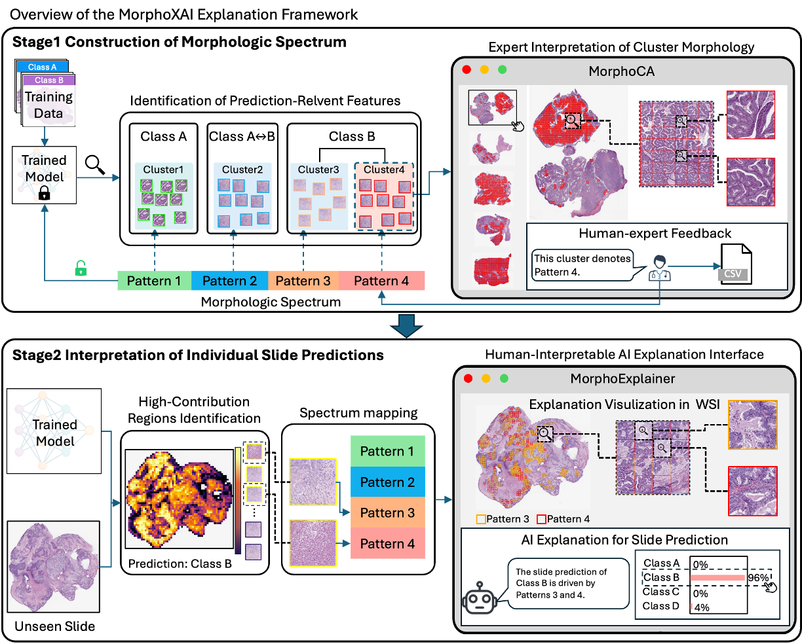

# MorphoXAI: A Human-in-the-Loop Explanation Framework for WSI-Based Deep Learning Models

This repository contains the implementation of **MorphoXAI**, a *human-in-the-loop explanation framework* designed to make deep learning models for whole-slide image (WSI) prediction tasks **morphologically transparent** and **expert-interpretable**.

As illustrated in the figure below, MorphoXAI consists of **two major stages**, each enabled by a dedicated set of scripts and QuPath-based expert-interaction tools.


------

## **Stage 1 — Construction of the Morphologic Spectrum**

In the first stage, a trained deep learning model is probed to identify **prediction-relevant feature groups** learned during training—including those that strongly define each class and those that lead to **inter-class confusion**.

These feature groups (clusters) are then mapped back to their original WSI regions.
 Using the human–AI interaction tool **MorphoCA**, pathologists examine the regions belonging to each feature group across multiple slides, interpret their **shared histomorphologic characteristics**, and assign a corresponding morphological pattern.

Together, these expert-interpreted patterns form the **morphologic spectrum**, which serves as the *global explanation* of how the model organizes and uses morphological evidence.

The scripts and documentation for Stage 1 are located in:

```
Morphologic_Spectrum_Construction/
```

------

## **Stage 2 — Interpretation of Individual Slide Predictions**

In the second stage, the constructed morphologic spectrum is used to explain the model’s **individual predictions** on independent slides.

For each slide, the model’s **high-contribution regions** are identified and mapped to their corresponding patterns within the spectrum, producing a **slide-specific, morphology-grounded local explanation**.

These explanations—along with the model’s prediction scores—are presented through the human–AI interaction tool **MorphoExplainer**, which allows users to explore how the model makes decisions directly within the WSI viewer.

The scripts and documentation for Stage 2 are located in:

```
Interpretation_of_Individual_Slide/
```

------

## **QuPath Plugins**

This repository includes two QuPath extensions supporting both stages of MorphoXAI:

```
plugins/
  ├── MorphoCA (expert interpretation of feature clusters)
  └── MorphoExplainer (spectrum-based slide-level explanation viewer)
```

------

## **Environment Setup**

Instructions for installing dependencies and setting up the required environment are provided in the Stage 1 module:

```
Morphologic_Spectrum_Construction/README.md
```