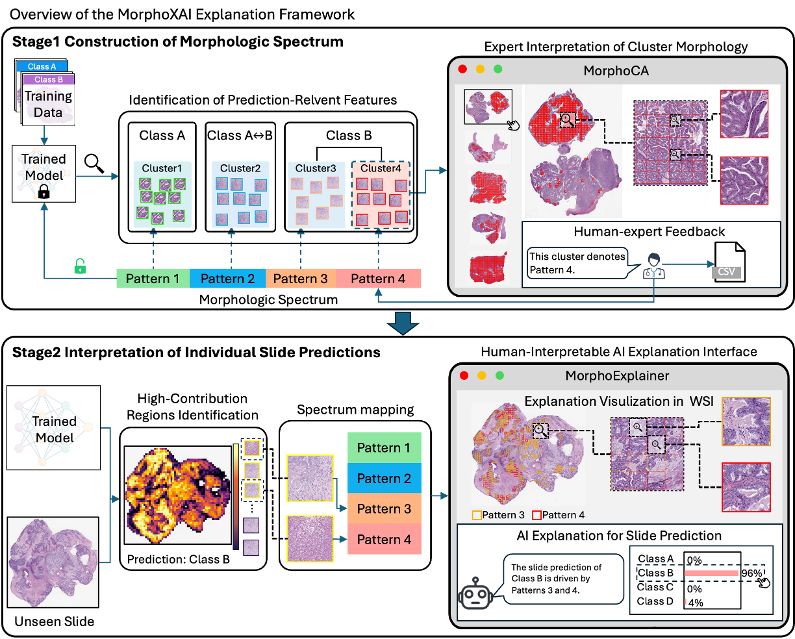

# MorphoXAI: A Human-in-the-Loop Explanation Framework for WSI-Based Deep Learning Models

This repository contains the implementation of MorphoXAI, a *human-in-the-loop explanation framework* designed to make deep learning models for whole-slide image (WSI) prediction tasks morphologically transparent and expert-interpretable.

As illustrated in the figure below, MorphoXAI consists of **two major stages**, each enabled by a set of scripts and QuPath-based expert-interaction tools.

<p align="center">
  
</p>

Correspondingly, the overall directory structure is summarized below:

```
MorphoXAI/
  ├── Morphologic_Spectrum_Construction/     # Stage 1 scripts
  ├── Interpretation_of_Individual_Slide/    # Stage 2 scripts
  ├── notebooks/                             # Jupyter notebooks for demos
  ├── plugins/                               
  │     ├── MorphoCA                         # QuPath plugin
  │     └── MorphoExplainer                  # QuPath plugin
  ├── environment.yml                         
  └── README.md
```

## **Stage 1 — Construction of the Morphologic Spectrum**

In the first stage, a trained deep learning model is probed to identify prediction-relevant feature groups learned during training—including those that strongly define each class and those that lead to inter-class confusion.

These feature groups (clusters) are then mapped back to their original WSI regions.
Using the human–AI interaction tool MorphoCA, pathologists examine the regions belonging to each feature group across multiple slides, interpret their shared histomorphologic characteristics, and assign a corresponding morphological pattern.

Together, these expert-interpreted patterns form the morphologic spectrum, which serves as the *global explanation* of how the model organizes and uses morphological evidence.

The scripts and detailed documentation for Stage 1 are provided in:

```
Morphologic_Spectrum_Construction/
```

A runnable demo for Stage 1 is provided in:

```
notebooks/morphologic_spectrum_construction.ipynb
```

------

## **Stage 2 — Interpretation of Individual Slide Predictions**

In the second stage, the constructed morphologic spectrum is used to explain the model’s individual predictions on independent slides.

For each slide, the model’s high-contribution regions are identified and mapped to their corresponding patterns within the spectrum, producing a slide-specific, morphology-grounded local explanation.

These explanations—along with the model’s prediction scores—are presented through the human–AI interaction tool MorphoExplainer, which allows users to explore how the model makes decisions directly within the WSI viewer.

The scripts and detailed documentation for Stage 2 are provided in:

```
Interpretation_of_Individual_Slide/
```

A simple runnable demo for Stage 2 is provided in:

```
notebooks/interpretation_of_individual_slide.ipynb
```

------

## **QuPath Plugins**

This repository includes two QuPath extensions supporting both stages of MorphoXAI:

```
plugins/
  ├── MorphoCA (expert interpretation of feature clusters)
  └── MorphoExplainer (spectrum-based slide-level explanation viewer)
```

The usage manuals for both plugins—MorphoCA Manual and MorphoExplainer Manual—are also provided in the plugins/ directory.

------

## Install dependencies

Create the base conda environment (without CONCH):

```
conda env create -f environment.yml
conda activate MorphoSpec
```

Then, install CONCH from GitHub as a post-installation step:

```
pip install git+https://github.com/Mahmoodlab/CONCH.git
```

## **Implementation Notes**

This repository’s implementation of MorphoXAI is built on top of the CLAM multiple-instance learning framework. Accordingly, the preprocessing, feature-bag generation, and training scripts follow the input/output conventions of CLAM (e.g., `.h5` feature bags, slide-level metadata CSVs, and CLAM-style training loops).

Users who wish to adapt MorphoXAI to other MIL architectures (such as TransMIL, ABMIL, DSMIL, or transformer-based models) may modify these components to match the data formats and training requirements of their chosen model. The overall MorphoXAI workflow—spectrum construction and slide-level explanation—remains compatible with alternative MIL backbones.

## Citation

If you use this repository in your research, please cite:

```bibtex
@article{lou2026morphoxai,
  title={A human-in-the-loop explanation framework for morphologically transparent AI predictions from whole-slide images},
  author={Lou, Peiliang and Zhu, Yi and Chia, Nicholas and others},
  journal={npj Digital Medicine},
  year={2026},
  doi={10.1038/s41746-026-02741-z}
}
```

Reference:

Lou, P., Zhu, Y., Chia, N. et al. *A human-in-the-loop explanation framework for morphologically transparent AI predictions from whole-slide images*. npj Digital Medicine (2026). https://doi.org/10.1038/s41746-026-02741-z